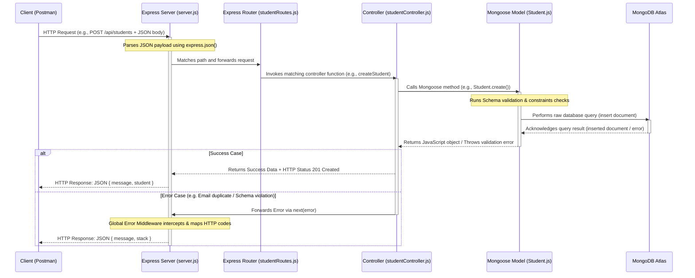

# Student Management System API

A beginner-friendly, production-ready RESTful API for a **Student Management System** built using the MERN backend stack (**Node.js, Express.js, MongoDB, and Mongoose**). The project follows industry-standard design patterns, clean coding practices, and organized folder structure.

---

## Table of Contents
1. [Project Overview](#project-overview)
2. [Features](#features)
3. [Folder Structure](#folder-structure)
4. [Request-Response Cycle Flow](#request-response-cycle-flow)
5. [How CRUD Works Internally](#how-crud-works-internally)
6. [Tech Stack](#tech-stack)
7. [Installation & Setup](#installation--setup)
8. [MongoDB Atlas Setup Guide](#mongodb-atlas-setup-guide)
9. [API Endpoints Table](#api-endpoints-table)
10. [Postman Testing Guide](#postman-testing-guide)

---

## Project Overview
This API provides backend services to manage student records. It allows client applications (like Postman or a frontend application) to perform basic CRUD operations (Create, Read, Update, Delete) on student documents stored in a cloud-hosted MongoDB Atlas database.

---

## Features
- **Complete CRUD Operations**: Full capability to create, read, update, and delete student data.
- **Mongoose Validation**: Robust data verification including email formatting, string trimming, and required fields constraints.
- **Centralized Error Handling**: Custom global middleware mapping MongoDB errors (duplicate emails, validation errors, invalid object IDs) to standard HTTP status codes.
- **Modern ES Modules Syntax**: Uses clean, native ES6 `import`/`export` statements.
- **Index Optimization**: Optimized index on the unique `email` field for high-speed queries.

---

## Folder Structure
```text
student-management-api/
│
├── config/
│   └── db.js                 # Database connection file using Mongoose
│
├── controllers/
│   └── studentController.js  # Main CRUD logic for handling HTTP requests
│
├── models/
│   └── Student.js            # Mongoose Schema & validation for Student records
│
├── routes/
│   └── studentRoutes.js      # Express Routing configurations
│
├── .env                      # Local environment configuration file (ignored in git)
├── server.js                 # Entry point of the server and central configuration
├── package.json              # Project manifest and command scripts
└── README.md                 # Professional system documentation (this file)
```

---

## Request-Response Cycle Flow
Understanding how data flows between the client and database is critical for backend developers. Below is the step-by-step Request-Response cycle of this application:



---

## How CRUD Works Internally
Here is the inner database mechanism of the CRUD operations:

1. **Create (C)**: Uses `Student.create(data)` (or `new Student(data).save()`). Under the hood, Mongoose transforms JavaScript variables into BSON (Binary JSON), executes schema validations on the server side, and transmits an `insert` command to the MongoDB Atlas replica set over a secure socket connection.
2. **Read (R)**:
   - *Get All*: Uses `Student.find().sort({ createdAt: -1 })`. Mongoose sends a query statement to MongoDB. The database searches the indexes, locates records, and streams back matching documents, which Mongoose maps back to JavaScript Arrays.
   - *Get By ID*: Uses `Student.findById(id)`. This utilizes the cluster's default `_id` index (a BSON ObjectId composed of timestamp, machine ID, process ID, and counter) to find a single document in logarithmic time $O(\log N)$.
3. **Update (U)**: Uses `Student.findByIdAndUpdate(id, data, { new: true, runValidators: true })`. Mongoose sends a `$set` operator to the specific document matching the `_id`. Mongoose executes schema validators prior to updating, ensuring that updated data does not breach format constraints.
4. **Delete (D)**: Uses `Student.findByIdAndDelete(id)`. This locates the target document in the primary node and initiates an atomic deletion. The document is flagged as deleted, index entries are cleaned, and an acknowledgement payload is sent back.

---

## Tech Stack
- **Runtime Environment**: [Node.js](https://nodejs.org/) (v16+)
- **Backend Framework**: [Express.js](https://expressjs.com/)
- **Database Engine**: [MongoDB Atlas](https://www.mongodb.com/cloud/atlas) (Cloud)
- **Object Data Modeling (ODM)**: [Mongoose](https://mongoosejs.com/)
- **Environment Management**: [dotenv](https://www.npmjs.com/package/dotenv)
- **Hot-Reloading**: [nodemon](https://nodemon.io/) (Development only)

---

## Installation & Setup

Follow these simple steps to set up the project locally:

### 1. Clone or Extract Project
Ensure all files are placed in your working folder.

### 2. Install Dependencies
Run the command below in the project root directory:
```bash
npm install
```

### 3. Environment File Configuration
Create a `.env` file in the root directory (or update the existing one) with the following structure:
```env
PORT=5000
MONGO_URI=mongodb+srv://<username>:<password>@<cluster>.mongodb.net/student-management?retryWrites=true&w=majority
```
> **Backend Tip**: If your database password contains special characters (like `@`, `:`, `/`, or `+`), you must URL-encode them. For instance, `arman@2006` becomes `arman%402006`.

---

## MongoDB Atlas Setup Guide

To get your free MongoDB Atlas database connection string:

1. **Create an Account**: Sign up at [mongodb.com/cloud/atlas](https://www.mongodb.com/cloud/atlas).
2. **Build a Database**: Create a new free cluster (Shared Tier M0) and select your preferred cloud provider (e.g., AWS) and region.
3. **Create Database User**:
   - Navigate to **Security > Database Access**.
   - Click **Add New Database User**.
   - Set Authentication Method to **Password**.
   - Input username (e.g. `arman_db_user`) and password (e.g. `arman@2006`).
   - Assign user privileges as **Read and Write to any database**.
4. **Configure Network Access**:
   - Navigate to **Security > Network Access**.
   - Click **Add IP Address**.
   - Select **Allow Access From Anywhere** (IP `0.0.0.0/0`) or whitelist your current IP address. Click **Confirm**.
5. **Get Connection String**:
   - Go to the **Database** tab under Deployment.
   - Click **Connect** on your cluster.
   - Select **Drivers** (Node.js).
   - Copy the connection string. It will look like this:
     ```text
     mongodb+srv://<username>:<password>@cluster0.xxxx.mongodb.net/?retryWrites=true&w=majority&appName=Cluster0
     ```
   - Replace `<username>` and `<password>` with your created database credentials. Replace the default database name if desired (e.g., `/student-management`).

---

## API Endpoints Table

| Feature | HTTP Method | Route Endpoint | Request Body (JSON) | Expected Status Code |
|:---|:---|:---|:---|:---|
| **Create Student** | `POST` | `/api/students` | `{ "name": "Mohammad Arman", "email": "arman@gmail.com", "course": "B.Tech" }` | `201 Created` |
| **Get All Students** | `GET` | `/api/students` | None | `200 OK` |
| **Get Student By ID** | `GET` | `/api/students/:id` | None | `200 OK` |
| **Update Student** | `PUT` | `/api/students/:id` | `{ "course": "Computer Science" }` (or any name/email field) | `200 OK` |
| **Delete Student** | `DELETE` | `/api/students/:id` | None | `200 OK` |

---

## Running the Server

- **Development Mode** (with automatic reload on code changes):
  ```bash
  npm run dev
  ```
- **Production Mode**:
  ```bash
  npm start
  ```

Once running successfully, you should see console logs similar to:
```text
Server running on port 5000 in development mode
MongoDB Connected: arman-shard-00-00.hou2po3.mongodb.net
```

---

## Postman Testing Guide

Open [Postman](https://www.postman.com/) and follow these steps to test each CRUD endpoint:

### 1. Create Student (POST)
* **Method**: `POST`
* **URL**: `http://localhost:5000/api/students`
* **Headers**: `Content-Type: application/json`
* **Body** (Select `raw` and format `JSON`):
  ```json
  {
    "name": "Mohammad Arman",
    "email": "arman@gmail.com",
    "course": "B.Tech"
  }
  ```
* **Expected Status**: `201 Created`
* **Expected Response**:
  ```json
  {
    "message": "Student created successfully",
    "student": {
      "_id": "64ef8b6c8df839818ab44883",
      "name": "Mohammad Arman",
      "email": "arman@gmail.com",
      "course": "B.Tech",
      "createdAt": "2026-06-07T06:08:00.000Z",
      "updatedAt": "2026-06-07T06:08:00.000Z",
      "__v": 0
    }
  }
  ```
* **Screenshot Reference**: `[POST Request Setup & Response]` (Insert Postman response image here)

---

### 2. Get All Students (GET)
* **Method**: `GET`
* **URL**: `http://localhost:5000/api/students`
* **Expected Status**: `200 OK`
* **Expected Response**: An array containing all student objects.
  ```json
  [
    {
      "_id": "64ef8b6c8df839818ab44883",
      "name": "Mohammad Arman",
      "email": "arman@gmail.com",
      "course": "B.Tech",
      "createdAt": "2026-06-07T06:08:00.000Z",
      "updatedAt": "2026-06-07T06:08:00.000Z",
      "__v": 0
    }
  ]
  ```
* **Screenshot Reference**: `[GET All Request & Response]` (Insert Postman response image here)

---

### 3. Get Student By ID (GET)
* **Method**: `GET`
* **URL**: `http://localhost:5000/api/students/64ef8b6c8df839818ab44883` *(replace with actual ID from step 1)*
* **Expected Status**: `200 OK`
* **Expected Response**:
  ```json
  {
    "_id": "64ef8b6c8df839818ab44883",
    "name": "Mohammad Arman",
    "email": "arman@gmail.com",
    "course": "B.Tech",
    "createdAt": "2026-06-07T06:08:00.000Z",
    "updatedAt": "2026-06-07T06:08:00.000Z",
    "__v": 0
  }
  ```
* **Screenshot Reference**: `[GET By ID Request & Response]` (Insert Postman response image here)

---

### 4. Update Student (PUT)
* **Method**: `PUT`
* **URL**: `http://localhost:5000/api/students/64ef8b6c8df839818ab44883` *(replace with actual ID)*
* **Headers**: `Content-Type: application/json`
* **Body** (`raw` - `JSON`):
  ```json
  {
    "course": "Computer Science"
  }
  ```
* **Expected Status**: `200 OK`
* **Expected Response**:
  ```json
  {
    "message": "Student updated successfully"
  }
  ```
* **Screenshot Reference**: `[PUT Request Setup & Response]` (Insert Postman response image here)

---

### 5. Delete Student (DELETE)
* **Method**: `DELETE`
* **URL**: `http://localhost:5000/api/students/64ef8b6c8df839818ab44883` *(replace with actual ID)*
* **Expected Status**: `200 OK`
* **Expected Response**:
  ```json
  {
    "message": "Student deleted successfully"
  }
  ```
* **Screenshot Reference**: `[DELETE Request Setup & Response]` (Insert Postman response image here)

---

### 6. Error Handling Scenarios (Testing Edge Cases)

#### A. Invalid ID (400 Bad Request)
- **Action**: Call `GET /api/students/123` (Invalid hex format/length for MongoDB ObjectId).
- **Expected Status**: `400 Bad Request`
- **Response**:
  ```json
  {
    "message": "Invalid MongoDB ID format"
  }
  ```

#### B. Student Not Found (404 Not Found)
- **Action**: Call `GET /api/students/64ef8b6c8df839818ab44889` (Valid length format but does not exist in database).
- **Expected Status**: `404 Not Found`
- **Response**:
  ```json
  {
    "message": "Student not found with ID: 64ef8b6c8df839818ab44889"
  }
  ```

#### C. Duplicate Email Validation (400 Bad Request)
- **Action**: Attempt to create another student (POST) with `email: "arman@gmail.com"` which already exists in database.
- **Expected Status**: `400 Bad Request`
- **Response**:
  ```json
  {
    "message": "Email address already exists. Please use a unique email."
  }
  ```

#### D. Missing Required Fields (400 Bad Request)
- **Action**: Send `POST /api/students` with missing `name` or `course` parameters.
- **Expected Status**: `400 Bad Request`
- **Response**:
  ```json
  {
    "message": "Please provide all required fields: name, email, and course"
  }
  ```
